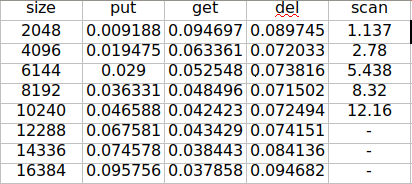
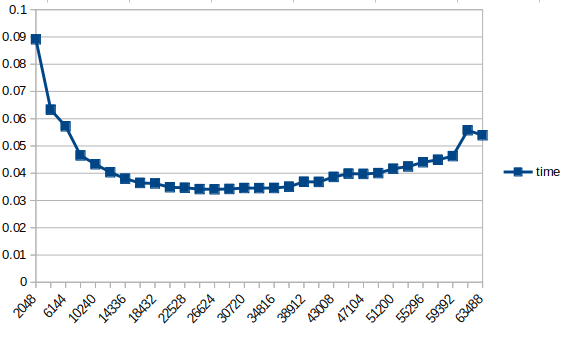
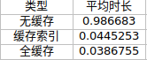
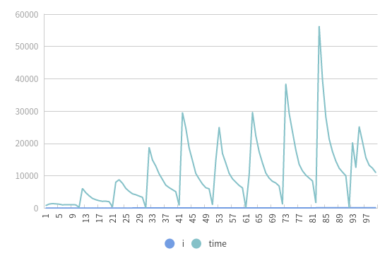

## Project LSM-KV: KVStore using Log-structured Merge Tree


The handout files include two main parts:

- The `KVStoreAPI` class in `kvstore_api.h` that specifies the interface of KVStore.
- Test files including correctness test (`correctness.cc`) and persistence test (`persistence.cc`).

Explanation of each handout file:

```text
.
├── Makefile  // Makefile if you use GNU Make
├── README.md // This readme file
├── include
|   ├── cache.h // cache of sstable
|   ├── const.h
|   ├── kvstore_api.h  // KVStoreAPI, you should not modify this file
|   ├── kvstore.h      // your implementation
|   ├── MurmurHash3.h  // Provides murmur3 hash function
|   ├── Node.h  // node of skiplist
|   ├── random.h    // produce random number
|   ├── skiplist.h  // impl of skiplist
|   ├── ssTable.h   // interface of ssTable
|   ├── test.h         // Base class for testing, you should not modify this file
|   └── utils.h         // Provides some cross-platform file/directory interface
├── cache.cc    // implementation of cache.h
├── correctness.cc // Correctness test, you should not modify this file
├── kvstore.cc     // implementation of kvstore
├── data      // Data directory used in our test
├── persistence.cc // Persistence test, you should not modify this file
└── ssTable.cc  // impl of ssTable
```

## 背景介绍

LSM(Log-Structured-Merge-Tree) 是一种存储结构，它的存储分为内存和磁盘两部分。由于计算机的内存容量小而且不能长久保存，磁盘容量大能长时间保存但读写速度慢。为了解决这个矛盾， LSM-KV 提出一种基于内存和磁盘的存储结构，此 Project 要求我们实现一个 LSM-KV。


## 数据结构和算法概括

### 数据结构

#### skiplist

跳表（skiplist）是一种数据结构。它使得包含 n 个元素的有序序列的查找和插入操作的平均时间复杂度都是 O(logn)，优于数组的 O(n) 复杂度。快速的查询效果是通过维护一个多层次的链表实现的，且与前一层（下面一层）链表元素的数量相比，每一层链表中的元素的数量更少。跳表在本项目中充当的角色是内存数据结构，因为它增删改查的性能都比较好，实现起来也比较简单（相比于红黑树等）。

#### SSTable

SSTable 提供一个可持久化，有序的、不可变的从键到值的映射关系。本项目的 SSTable 包括 header、 bloomfilter、 key-offset 和value 五部分，具体不在这里介绍。 SSTable 最大的特点就是只读，只能创建而不能修改和删除里面的某个数据。

### 算法

#### 归并排序

在 sstable 的某一层满后，要与下一层进行归并排序，这里直接使用了std::list 封装好的 merge 方法，省了很多时间。但这个方法要求两个 list 是提前有序的，这一点是由 SSTable 的有序性保证的。还有一点对于自定义的类要额外写一个排序函数表明排序规则。

## 测试

### 性能测试

#### 预期结果

* `Get` 对于 GET 操作, 首先从 MemTable 中进行查找, 当查找到键 K 所对应的记录之后结束。若 MemTable 中不存在键 K, 则先从内存里逐层查看缓存的每一个 SSTable, 先用 BloomFilter 中判断 K 是否在当前SSTable 中, 如果可能存在则用二分查找在索引中找到对应的 offset,之后从硬盘中读取对应的文件并根据 offset 取出 value。对于 Get 操作，元素较少时不用访问磁盘，需要 logn 的时间；元素较多时，在内存中找到的概率很小，因此期望时间较长。

* `Put` 对于 Put 操作，首先尝试在 MemTable 中插入，这一步插入需要 O(logn) 时间，其中 n 为 Memtable 中元素数量，如果大小超出限制，需要把 Memtable 内容整体写入磁盘，这一步与已插入元素有关，相比于内存插入需要耗费很长时间。后者是 Put 操作主要时间开销来源。

* `Del` Del 操作涉及到一个搜索和一个插入，总体时间和前两步操作有关。

* `Scan` scan 操作要扫描整个 Memtable 和磁盘文件，但由于缓存在内存中的cache，只有范围相交的文件会被读取，因此耗费时间会节省一些。但是 scan 操作还是这四个操作中最耗时的一个，由于区间范围不一定，scan 可能要访问很多磁盘文件，读取很多数据。



#### 常规分析
可以看到，在数据规模较小时， put、 scan 和 del 的时间都比较短因为不涉及到读取磁盘文件。并且 del 的时延稳定高于 put。至于 get 操作时延在变小，我不太能理解， get 每次只获取一个数，在 cache 中缓存这 sstable的 key 保证其稳定找到准确的磁盘文件，一次操作的耗时与数据规模的关系获取没有其它几个操作大。在扩大了数据规模之后，如图 2，发现 get 的平均时间增长，总体来说 get 的时间是增长的。对于 scan 操作，我设定的是对于不同的 size 扫描 (0, size/2)，这里只列出了前几个 size 的时间，后面时间过长便没有等待记录。

#### 索引缓存与 Bloom Filter 的效果测试
需要对比下面三种情况 GET 操作的平均时延
1. 内存中没有缓存 SSTable 的任何信息，从磁盘中访问 SSTable 的索引，在找到 offset 之后读取数据

2. 内存中只缓存了 SSTable 的索引信息，通过二分查找从 SSTable 的索引中找到 offset，并在磁盘中读取对应的值

3. 内存中缓存 SSTable 的 Bloom Filter 和索引，先通过 Bloom Filter判断一个键值是否可能在一个 SSTable 中，如果存在再利用二分查找，否则直接查看下一个 SSTable 的索引

这里采用固定大小数据进行测试，数据大小为 1024*32，结果如表所示。可以看出，全缓存无疑是速度最快的，只缓存索引不缓存 bloomfilter 相比于前者慢一些。无缓存最慢，因为要访问每一个 sst 文件。





#### Compaction 的影响
不断插入数据的情况下，统计每秒钟处理的 PUT 请求个数（即吞吐量），并绘制其随时间变化的折线图，测试需要表现出compaction 对吞吐量的影响。可以让键值对中 value 占用的空间大一些，从而提高 compaction的频率，这样效果比较明显这里选择插入 40k 组数据，每 400 组统计一次时间，每个数据的 value 为 string(500, ’s’), 结果如图。吞吐量降低就是由compaction 引起的，可以看出，插入达到一定数量就要进行一次合并。

